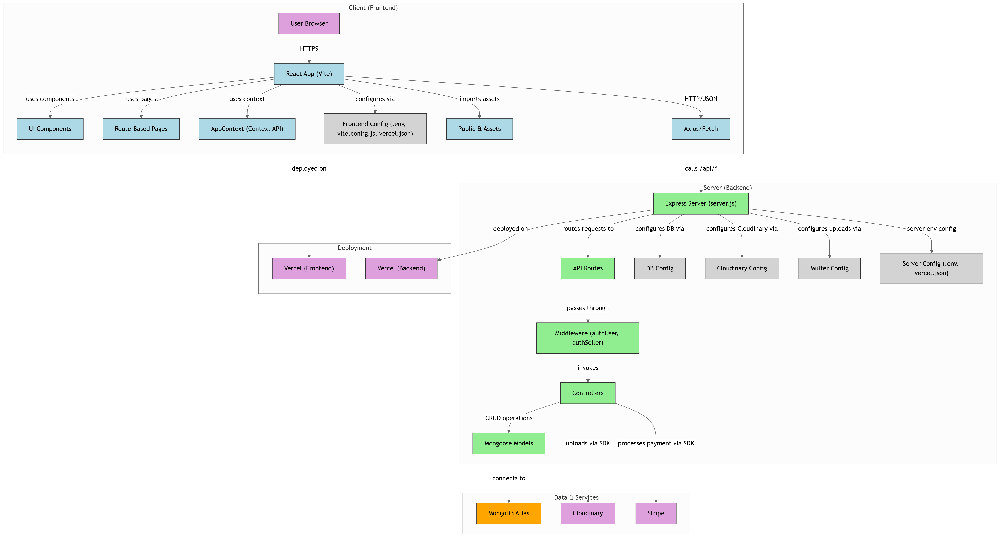

## 🛍 GreenCart

GreenCart is an eco-friendly e-commerce platform designed for sustainable shopping experiences. Built with **MERN** stack technologies and styled with **Tailwind CSS**, it supports features like cart management, secure checkout, payment integration, and media upload. The project emphasizes clean design, performance, and an eco-conscious catalog system.

---

## 🧠 Project Architecture

```
greencart/
├── client/                     # Frontend: React + Vite + Tailwind
│   ├── src/
│   │   ├── components/         # Reusable UI components
│   │   ├── context/            # Global state/context providers
│   │   ├── pages/              # Main page views
│   │   ├── App.jsx             # Root component
│   │   ├── main.jsx            # Entry point
│   │   └── index.css           # Global styles
│   ├── .env                    # Vite environment variables
│   └── vercel.json             # Vercel deployment config
│
├── server/                    # Backend: Express + Mongoose
│   ├── configs/               # DB config and other setup
│   ├── controllers/           # Route logic
│   ├── middleware/            # Auth, error handling, etc.
│   ├── models/                # MongoDB data schemas
│   ├── routes/                # API route definitions
│   ├── .env                   # API keys and secrets
│   ├── server.js              # Entry point
│   └── vercel.json            # Vercel backend config
│
├── README.md                  # Project documentation
```


---

## 🔧 Tech Stack

### 🧠 Layered Summary

| Layer        | Technologies Used                                | Description                                                         |
|--------------|--------------------------------------------------|---------------------------------------------------------------------|
| Frontend     | React, Vite, Axios, TailwindCSS, ESLint          | User interface, routing, API consumption, and component styling     |
| Backend      | Node.js, Express.js, Mongoose, Nodemon           | REST API, MongoDB models, middleware, and server-side logic         |
| Cloud/Media  | Cloudinary, Stripe                               | Image uploads and payment gateway integration                       |
| Environment  | .env files (Vite + Node)                         | Secure API key and secret storage                                   |
| Deployment   | Vercel (client + server folders)                 | CI/CD for both frontend and backend on Vercel                       |
                    


## 🚀 Getting Started

Follow these steps to run the project locally:

### 1. Clone the Repository

```bash
git clone https://github.com/GitGuru826004/greencart.git
cd greencart
```

### 2. Set Up the Client (Frontend)

```bash
cd client
npm install
npm run dev
```

> Runs on Vite (default: http://localhost:5173)

### 3. Set Up the Server (Backend)

```bash
cd ../server
npm install
npm run server
```

> Runs on Node + Express (default: http://localhost:4000)

### 4. Environment Setup

- Create `.env` files in both `/client` and `/server` directories.
- Example fields:
  - For client:
    ```
    VITE_API_BASE_URL=http://localhost:4000
    VITE_CLOUDINARY_UPLOAD_PRESET=your_upload_preset
    VITE_CLOUDINARY_CLOUD_NAME=your_cloud_name
    VITE_STRIPE_PUBLISHABLE_KEY=your_key
    ```
  - For server:
    ```
    PORT=4000
    MONGO_URI=your_mongodb_uri
    CLOUDINARY_API_KEY=your_key
    CLOUDINARY_API_SECRET=your_secret
    CLOUDINARY_CLOUD_NAME=your_name
    STRIPE_SECRET_KEY=your_stripe_secret
    ```

### 5. Deployment

This project is deployed via **Vercel**:

- `/client` → frontend deployment
- `/server` → backend deployment


## 🧪 Features

🛒 Full-fledged eCommerce functionality  
♻️ Eco-friendly product catalog with sustainability tags  
📦 Product creation, update, and deletion (Admin only)  
🔍 Dynamic product search and filtering  
🧾 Cart and checkout with Stripe integration  
🌐 Image hosting via Cloudinary  
👤 Role-based access control (Admin, Users)  
📊 Order management and status updates  
📱 Fully responsive UI using Tailwind CSS  
🛠️ Modular code structure with clear separation of concerns  
🚀 Deployable on Vercel (frontend + backend)


## 👤 Solo Developer

| Name           | Responsibilities                                         |
|----------------|----------------------------------------------------------|
| Anupam Garg    | Full-stack development, UI/UX design, backend APIs, integration with Stripe and Cloudinary, deployment on Vercel |


## 📂 Folder Breakdown

```
greencart/
├── client/                 # Frontend - React.js with Tailwind CSS
│   ├── public/             # Static assets
│   └── src/
│       ├── assets/         # Images, icons, and illustrations
│       ├── components/     # Reusable UI components (e.g., ProductCard, Header)
│       ├── context/        # Global state management (e.g., CartContext)
│       ├── pages/          # Route-based pages (Home, ProductDetails, Checkout, etc.)
│       ├── App.jsx         # Main app component
│       ├── main.jsx        # Entry point
│       └── index.css       # Global styles
│   └── .env                # Environment variables
│   └── vercel.json         # Vercel deployment config

├── server/                 # Backend - Node.js with Express
│   ├── configs/            # Database & cloud configuration (MongoDB, Cloudinary)
│   ├── controllers/        # Request handlers (products, users, cart, orders)
│   ├── middleware/         # Error handling, authentication, etc.
│   ├── models/             # Mongoose schemas (Product, User, Order)
│   ├── routes/             # API endpoints
│   ├── server.js           # Main server file
│   ├── .env                # Backend environment variables
│   └── vercel.json         # Vercel serverless deployment config

├── README.md               # Project documentation
```


## 🌐 Live Demo

Experience GreenCart live:  
🔗 [https://greencart-frontend-zeta.vercel.app](https://greencart-frontend-zeta.vercel.app)

## 📌 Links

- GitHub Repository: [https://github.com/GitGuru826004/greencart](https://github.com/GitGuru826004/greencart)  
- Live Application: [https://greencart-frontend-zeta.vercel.app](https://greencart-frontend-zeta.vercel.app)
